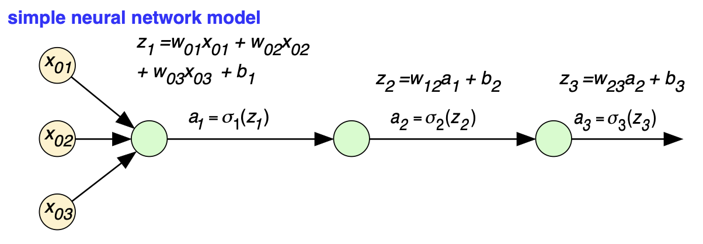
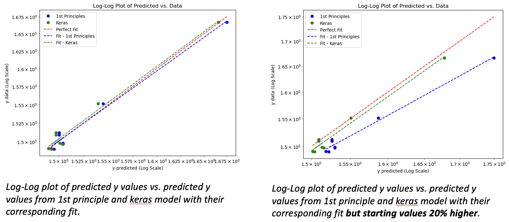
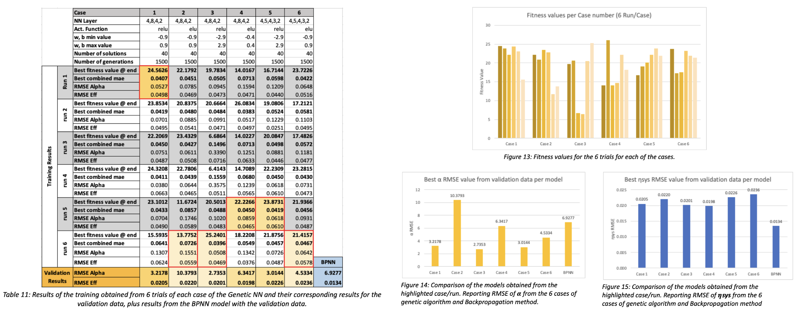

## Project Overview

This project is divided into two main parts:

1. **First Principle Neural Network vs. Keras Python Software:** The first part of the project is dedicated to comparing a custom-built neural network based on first principles with a neural network implemented using the Keras library in Python. The objective is to evaluate the performance and accuracy of both approaches in predicting outcomes in a given dataset.

2. **Prediction Analysis for a Hybrid Fossil-Fuel Gas Turbine using Machine Learning Neural Networks:** The second part of the project focuses on utilizing machine learning neural networks to predict and analyze the performance of a hybrid fossil-fuel gas turbine. The goal is to assess the feasibility and accuracy of machine learning models in predicting the behavior and efficiency of complex energy systems.

## Objectives

### Part 1: First Principle Neural Network vs. Keras Python Software

* **Custom Neural Network:** Develop a neural network from scratch using first principles and mathematical formulations to understand the core mechanics behind neural network operations.

* **Keras Implementation:** Use the Keras library in Python to implement a similar neural network model, leveraging pre-built functions and modules.

* **Comparison:** Analyze and compare the performance, accuracy, and computational efficiency of both models. The key metrics used for comparison include mean squared error (MSE), training time, and prediction accuracy.

### Part 2: Prediction Analysis for a Hybrid Fossil-Fuel Gas Turbine

* **Data Preparation:** Gather and preprocess data relevant to the operation and performance of a hybrid fossil-fuel gas turbine. This includes variables like fuel input, temperature, pressure, and turbine output.

* **Model Development:** Develop neural network models using Keras to predict the performance metrics of the turbine. The models are trained on historical data and tested for their predictive accuracy.

* **Analysis:** Evaluate the predictions generated by the neural network models. The analysis focuses on the accuracy of the predictions, the model's ability to generalize to new data, and the implications for optimizing turbine performance.

## Methodology

### Custom Neural Network (First Principles)

* **Mathematical Formulation:** The custom neural network is built using fundamental mathematical concepts such as linear algebra, calculus, and gradient descent. The network architecture includes an input layer, hidden layers with activation functions, and an output layer.

* **Training Process:** The network is trained using backpropagation, where the weights are adjusted iteratively to minimize the loss function.

### Keras Neural Network

* **Keras Framework:** The Keras library simplifies the process of building and training neural networks. In this project, the same network architecture as the custom model is implemented using Keras.

* **Training Process:** The Keras model is trained using built-in functions for compiling the model, fitting the data, and evaluating performance.

### Hybrid Fossil-Fuel Gas Turbine Analysis

* **Data Collection:** Data for the turbine's operation was collected, cleaned, and normalized to ensure consistency and accuracy in model training.

* **Model Training:** Multiple neural network architectures were tested to find the optimal configuration for predicting turbine performance. The training process involved adjusting hyperparameters and evaluating model performance on a validation set.

* **Prediction and Evaluation:** The trained model's predictions were compared to actual turbine performance data to assess accuracy. The results were analyzed to identify areas where the model performed well and where improvements could be made.

## Results

### Part 1: Neural Network Comparison
* **Performance:** The Keras-based neural network demonstrated superior performance in terms of training speed and accuracy compared to the custom-built network. This was largely due to the optimizations and advanced algorithms implemented in the Keras library.

* **Accuracy:** While both models achieved comparable accuracy in predictions, the Keras model was slightly more accurate, likely due to the more efficient handling of gradients and activation functions.

### Part 2: Gas Turbine Prediction
* **Model Accuracy:** The neural network model trained using Keras successfully predicted the turbine's performance with a high degree of accuracy. The model's predictions closely matched the actual performance data, indicating that machine learning can effectively model complex energy systems.

* **Insights:** The analysis revealed key operational parameters that significantly influence turbine performance. These insights could be used to optimize turbine operations and improve efficiency.

## Conclusion

This project highlights the effectiveness of using pre-built machine learning libraries like Keras for developing accurate and efficient neural network models. The comparison between a custom neural network and a Keras-based model underscores the advantages of using established frameworks in terms of performance and ease of use. Additionally, the successful application of machine learning to predict hybrid fossil-fuel gas turbine performance demonstrates the potential of these technologies in optimizing complex engineering systems.
